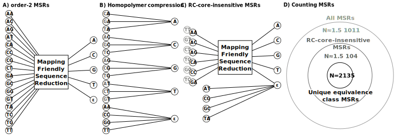
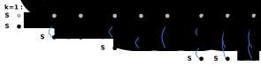
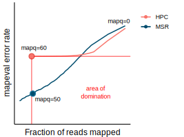
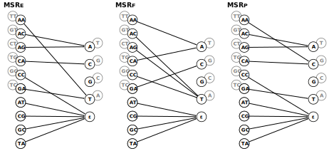

```{r, knitr_setup, include=FALSE}
library(knitr)
knitr::opts_chunk$set(message=FALSE, info=FALSE, warning=FALSE, echo=FALSE, cache=TRUE)
```

This notebook was used to generate the table and figures used in the MSR paper *([DOI](placeholder))*.

# Setup
Necessary libraries and general settings
```{r, setup, echo=TRUE}

library(readr)
library(dplyr)
library(tidyr)
library(stringr)
library(ggplot2)
library(kableExtra)
library(pafr)
library(rjson)
library(ggridges)

# Setting general theme options 
ggplot2::theme_set(ggplot2::theme_classic())
ggplot2::theme_update(
  strip.text=element_text(size=12, hjust=0, vjust=1),
  axis.title=element_text(size=12, hjust=0.5, vjust=0.5),
  axis.text=element_text(size=11, hjust=0.5, vjust=0.5),
)

# Mapq thresholds to show as points
point_thresholds <- seq(0, 60, 10)

# Undesirable MSRs 
to_reject <- c('R(3,False,60,1)',
 'R(3,False,5,2)',
 'R(3,False,4,2)',
 'R(3,False,48,2)',
 'R(3,False,38,0)',
 'R(4,True,27,6)',
 'R(4,True,24,10)')

colour_levels <- c("HPC", "raw", "MSR", "MSR E", "MSR F", "MSR P")
colors <- c("#F8766D", "#00BA38", "#619CFF26", "#004c6d", "#0098bb", "#51e3ff")
to_show <- c("MSR_E", "MSR_F", "MSR_P")
```

## Needed functions
### Custom Facet-wrapping
```{r, scale_overriding, echo=TRUE}

##########################
# SCALE OVERRIDING UTILS #
##########################

# from: https://dewey.dunnington.ca/post/2018/modifying-facet-scales-in-ggplot2/

scale_override <- function(which, scale) {
  if(!is.numeric(which) || (length(which) != 1) || (which %% 1 != 0)) {
    stop("which must be an integer of length 1")
  }
  
  if(is.null(scale$aesthetics) || !any(c("x", "y") %in% scale$aesthetics)) {
    stop("scale must be an x or y position scale")
  }
  
  structure(list(which = which, scale = scale), class = "scale_override")
}

CustomFacetWrap <- ggproto(
  "CustomFacetWrap", FacetWrap,
  init_scales = function(self, layout, x_scale = NULL, y_scale = NULL, params) {
    # make the initial x, y scales list
    scales <- ggproto_parent(FacetWrap, self)$init_scales(layout, x_scale, y_scale, params)
    
    if(is.null(params$scale_overrides)) return(scales)
    
    max_scale_x <- length(scales$x)
    max_scale_y <- length(scales$y)
    
    # ... do some modification of the scales$x and scales$y here based on params$scale_overrides
    for(scale_override in params$scale_overrides) {
      which <- scale_override$which
      scale <- scale_override$scale
      
      if("x" %in% scale$aesthetics) {
        if(!is.null(scales$x)) {
          if(which < 0 || which > max_scale_x) stop("Invalid index of x scale: ", which)
          scales$x[[which]] <- scale$clone()
        }
      } else if("y" %in% scale$aesthetics) {
        if(!is.null(scales$y)) {
          if(which < 0 || which > max_scale_y) stop("Invalid index of y scale: ", which)
          scales$y[[which]] <- scale$clone()
        }
      } else {
        stop("Invalid scale")
      }
    }
    
    # return scales
    scales
  }
)

facet_wrap_custom <- function(..., scale_overrides = NULL) {
  # take advantage of the sanitizing that happens in facet_wrap
  facet_super <- facet_wrap(...)
  
  # sanitize scale overrides
  if(inherits(scale_overrides, "scale_override")) {
    scale_overrides <- list(scale_overrides)
  } else if(!is.list(scale_overrides) || 
            !all(vapply(scale_overrides, inherits, "scale_override", FUN.VALUE = logical(1)))) {
    stop("scale_overrides must be a scale_override object or a list of scale_override objects")
  }
  
  facet_super$params$scale_overrides <- scale_overrides
  
  ggproto(NULL, CustomFacetWrap,
    shrink = facet_super$shrink,
    params = facet_super$params
  )
}
```

### Table formatting functions
```{r, table_format, echo=TRUE}
fmt_perc <- function(num) {
  if (is.na(num)) {
    return ("NAN")
  }
  if (num >= 0) {
    return(
      paste0("+", format(num, digits=1, width=3, justify="right"), "%")
    )
  }
  return (
    paste0(format(num, digits=1, width=3, justify="right"), "%")
  )
}

fmt_vec <- function(vec) {
  return(
    lapply(vec, fmt_perc)
  )  
}
```

## Data loading and pre-processing
```{r, data_loading, echo=TRUE}

evals <- read.csv("./data/MSR-evals.csv") %>%
    filter(!(renamed %in% to_reject)) %>%
    mutate(col=str_replace(MSR, "_", " ")) %>%
    mutate(col=factor(col, levels=colour_levels))
```


# Main text
## Figure 1 

|  |
|:--:|
| Figure 1 was made by hand using inkscape. |

## Figure 2

|  |
|:--:|
| Figure 2 was made by hand using inkscape. |

## Figure 3 
 
|  |
|:--:|
| Figure 3 is a modified version of panel A of figure 5. It was modified with inkscape. |


## Figure 4

|  |
|:--:|
| Figure 4 was made by hand using inkscape. |

## Figure 5

```{r, plot_custom_reordered, , , warning=FALSE, fig.height=3.5, fig.width=10, fig.align="center"}
facet_order <- c("whole_genome","whole_genome_repeats", "tandemtools")

default <- filter(evals, dataset != "drosophila" & dataset != "ecoli" & mapper=="minimap" & simulator=="nanosim" ) %>%
  mutate(dataset=factor(dataset, levels=facet_order))

# Position and label of MSR annotations in panels 
annotations <- data.frame(
  renamed = c("MSR E", "MSR F2", "MSR P", "MSR E", "MSR F2", "MSR P", "MSR E", "MSR F2", "MSR P"),
  dataset = c("tandemtools", "tandemtools", "tandemtools", 
              "whole_genome", "whole_genome", "whole_genome", 
              "whole_genome_repeats", "whole_genome_repeats", "whole_genome_repeats"),
  label = c("MSR[E]", "MSR[F]", "MSR[P]", 
            "MSR[E]", "MSR[F]", "MSR[P]", 
            "MSR[E]", "MSR[F]", "MSR[P]"),
  x = c(0.925 , 0.935 , 0.915, 
        0.95  , 0.9275, 0.927, 
        0.75  , 0.6   , 0.63 ),
  y = c(4.5e-3, 2.5e-3, 1.5e-3, 
        5e-5  , 8e-4  , 2e-4  , 
        1e-4  , 1.6e-4, 7e-5  )
) %>%
  mutate(dataset=factor(dataset, levels=facet_order))

# Facet labels
labels <- c(
  whole_genome="A)\tWhole human genome", 
  tandemtools="C)\tSynthetic centromeric\nsequence", 
  whole_genome_repeats="B)\tWhole human genome\n(repeated regions)"
)

background <- filter(default, !(MSR %in% to_show))
background_points <- filter(background, threshold %in% point_thresholds)

showed <- filter(default, MSR %in% to_show)
showed_points <- filter(showed, threshold %in% point_thresholds)

top <- filter(default, MSR %in% c("HPC", "raw"))
top_points <- filter(top, threshold %in% point_thresholds)

p <- ggplot(data=background, aes(x=fracReads, y=cumErrorRate, group=renamed, colour=col)) + 
  geom_line() + 
  geom_point(data=background_points) +
  geom_line(data=showed) +
  geom_point(data=showed_points) + 
  geom_line(data=top) + 
  geom_point(data=top_points) +
  geom_text(data=annotations, aes(x=x, y=y, label=label, hjust=1, fontface="bold.italic"), size=3.5, colour="black", parse=TRUE) +
  scale_y_continuous(trans="log10", limits=c(1e-6, 1e-1)) +
  annotation_logticks(sides="l", size=0.2, long=unit(2, "mm"), mid=unit(1, "mm"), short=unit(.5, "mm")) +
  scale_color_manual(values=colors, limits=colour_levels) +
  guides(color=guide_legend(title="Function\ntype:")) +
  labs(x="Fraction of reads mapped", y="Mapping error rate") +
  facet_wrap_custom(~ dataset, scale="free", labeller=labeller(dataset=labels), scale_overrides = list(
    scale_override(3, scale_x_continuous(limits=c(0.90, 1.0))),
    scale_override(3, scale_y_continuous(trans="log10", limits=c(1e-4, 1e-1))),
    scale_override(1, scale_x_continuous(limits=c(0.90, 1.0))),
    scale_override(2, scale_x_continuous(limits=c(0.5, 1.0))),
    scale_override(2, scale_y_continuous(trans="log10", limits=c(1e-5, 1e-1)))
  ))
ggsave("./figures/figure5.pdf", plot=p, height=3.5, width=10, units=c("in"))
p
```

## Table 1
```{r, main_table, }
to_show <- c("MSR_E", "MSR_F", "MSR_P")

tab <- evals %>%
  filter(
    (simulator == "nanosim") & (
      (dataset == "whole_genome") |
      ((dataset == "drosophila") & (mapper=="minimap"))
    )
  ) %>%
  filter((MSR %in% c("HPC", "raw") & (threshold == 60)) | 
           ((MSR %in% to_show) & (threshold == 50))) %>%
  select(dataset, threshold, MSR, fracReads, cumErrorRate, mapper) %>%
  pivot_wider(names_from=c(dataset, mapper), values_from=c(fracReads, cumErrorRate), names_sep=".") %>%
  rename(
    t=threshold, 
    fDM=fracReads.drosophila.minimap, fWM=fracReads.whole_genome.minimap, fWW=fracReads.whole_genome.winnowmap,
    eDM=cumErrorRate.drosophila.minimap, eWM=cumErrorRate.whole_genome.minimap, eWW=cumErrorRate.whole_genome.winnowmap,
  )

cols <- c("fDM", "fWM", "fWW", "eDM", "eWM", "eWW")

hpc <- tab %>%
  filter((MSR == "HPC") & (t==60)) %>%
  slice(rep(1,5))
perc <- (100*(tab[,cols] - hpc[,cols]) / hpc[,cols]) %>%
  rename_with(.fn = ~paste0("P", .x) )

to_format <- bind_cols(tab, perc) %>%
  mutate(across(c("fDM", "fWM", "fWW"), format, digits=3)) %>%
  mutate(across(c("eDM", "eWM", "eWW"), format, digits=3, scientific=TRUE)) %>%
  mutate(across(c("PfDM", "PfWM", "PfWW", "PeDM", "PeWM", "PeWW"), fmt_vec)) %>%
  relocate(
    MSR, t,
    fWM, PfWM, eWM, PeWM,
    fWW, PfWW, eWW, PeWW,
    fDM, PfDM, eDM, PeDM,
  )

kbl(to_format, booktabs=TRUE) %>%
  kable_styling() %>%
  add_header_above(c(" "=2, "Frac"=2, "Err"=2, "Frac"=2, "Err"=2, "Frac"=2, "Err"=2)) %>%
  add_header_above(c(" "=2, "minimap2"=4, "winnowmap"=4, "minimap2"=4))  %>%
  add_header_above(c(" "=2, "Whole HG"=4, "Whole HG"=4, "Droso"=4)) 
```
...

# Supplementary Material

## Additional functions for sup-mat
```{r, supmat-functions, echo=TRUE}

get_overlap <- function(rend, tstart, rstart, tend) {
  
  if (rend < tstart || rstart > tend) {
    return (0)
  }
  
  innerEnd <- min(rend, tend)
  outerEnd <- max(rend, tend)
  innerStart <- min(rstart, tstart)
  outerStart <- max(rstart, tstart)
  return (
    (innerEnd - innerStart) / (outerEnd - outerStart)
  )
}

parse_paf <- function(filepath, funcName, names) {
  gc()
  # raw <- filter_secondary_alignments(read_paf(filepath))
  raw <- filter_secondary_alignments(read_paf(filepath))
  
  df <- dplyr::as_tibble(raw) %>%
    mutate(rstart=as.integer(str_split(qname, "!", simplify=TRUE)[,3])) %>%
    mutate(rend=as.integer(str_split(qname, "!", simplify=TRUE)[,4])) %>%
    mutate(rtarget=str_split(qname, "!", simplify=TRUE)[,2]) %>%
    mutate(rstrand=str_split(qname, "!", simplify=TRUE)[,5]) %>% 
    mutate(rid=str_split(qname, "!", simplify=TRUE)[,1]) %>%
    rowwise() %>%
    mutate(overlap=get_overlap(rend, tstart, rstart, tend))
  
  df <- df %>% 
    mutate(correct=overlap>=0.1 && tname == rtarget) %>% 
    mutate(reduction=funcName) %>%
    mutate(chromosome=names[[rtarget]])
  gc()
  return(df)
  
}

parse_processed <- function(filepath, funcName, names) {
  df <- read_delim(filepath, delim="\t") %>%
    mutate(correct=as.logical(correct), reduction=funcName, chromosome=as.character(names[rtarget]))
  
  return(df)
}
```

Data loading
```{r, supmat-data-loading, echo=TRUE}
namesDic <- fromJSON(file="./data/case_study/names_chr.json")
mapping_raw <- parse_processed("./data/case_study/raw.processed.tab", "raw", namesDic)
mapping_hpc <- parse_processed("./data/case_study/hpc.processed.tab", "HPC", namesDic)
mapping_msr_p <- parse_processed("./data/case_study/msr_p.processed.tab", "MSR P", namesDic)
mapping_msr_e <- parse_processed("./data/case_study/msr_e.processed.tab", "MSR E", namesDic)
mapping_msr_f <- parse_processed("./data/case_study/msr_f.processed.tab", "MSR F", namesDic)
```
Centromere and stalk positions were obtained from the following file: 
<http://t2t.gi.ucsc.edu/chm13/hub/t2t-chm13-v1.1/cytobands/cytoBandIdeo.bigBed>

```{r, centromeres_positions, echo=TRUE}
centromeres <- tribble(
  ~chromosome, ~start, ~end,
  "1", 121796048, 126300487,
  "2", 92333543, 94673023,
  "3", 91738002, 96415026,
  "4", 49705154, 55199795,
  "5", 47039134, 49596625,
  "6", 58286706, 61058390,
  "7", 60414372, 63714499,
  "8", 44215832, 46325080,
  "9", 44951775, 47582595,
  "10", 39633793, 41664589,
  "11", 51035789, 54450838,
  "12", 34620838, 37202490,
  "13", 15547593, 17498291,
  "14", 10092112, 12708411,
  "15", 16678794, 17694466,
  "16", 35848286, 37829521,
  "17", 23892419, 27486939,
  "18", 15965699, 20933550,
  "19", 25817676, 29768171,
  "20", 26925852, 29099655,
  "21", 10962853, 11306205,
  "22", 12788180, 15711065,
  "X", 57820107, 60927025
)

stalks <- tribble(
  ~chromosome, ~start, ~end,
  "13", 5751447, 9368750,
  "14", 2077628, 2840421,
  "15", 2484618, 4728636,
  "21", 3084882, 5633495,
  "22", 4770731, 5743502 
)

order <- c(
  "1", "2", "3", "4", "5", "6", "7", "8", "9", "10", "11", "12",
  "13", "14", "15", "16", "17", "18", "19", "20", "21", "22", "X"
  )

reduction_order <- c("A", "MSR F2", "MSR P", "MSR E", "HPC", "raw")
```

## Table B.1
```{r, sup_mat_table, }
to_show <- c("MSR_E", "MSR_F", "MSR_P", "raw", "HPC")

tab <- evals %>%
  filter(
    (simulator == "nanosim") & 
    (dataset != "ecoli") &
    (threshold %in% c(60, 50, 0)) & 
    (MSR %in% to_show)
  ) %>%
  select(dataset, threshold, MSR, fracReads, cumErrorRate, mapper) %>%
  pivot_wider(names_from=threshold, values_from=c(fracReads, cumErrorRate), names_sep=".") %>%
  rename(d=dataset, m=mapper, f60=fracReads.60, e60=cumErrorRate.60, f50=fracReads.50, e50=cumErrorRate.50, f0=fracReads.0, e0=cumErrorRate.0) %>%
  arrange(d, m, MSR)

cols <- c("f60", "f50", "f0", "e60", "e50", "e0")

hpc <- tab %>%
  filter((MSR == "HPC")) %>%
  arrange(d, m) %>%
  slice(rep(1:n(),each=5))

perc <- (100*(tab[,cols] - hpc[,cols]) / hpc[,cols]) %>%
  rename_with(.fn = ~paste0("P", .x) )


to_format <- bind_cols(tab, perc) %>%
  mutate(across(c("f60", "f50", "f0"), format, digits=3)) %>%
  mutate(across(c("e60", "e50", "e0"), format, digits=3, scientific=TRUE)) %>%
  mutate(across(c("Pf60", "Pf50", "Pf0", "Pe60", "Pe50", "Pe0"), fmt_vec)) %>%
  relocate(
    d, m, MSR,
    f60, Pf60, e60, Pe60,
    f50, Pf50, e50, Pe50,
    f0, Pf0, e0, Pe0,
  )

kbl(to_format %>% select(-one_of(c("d", "m"))), booktabs=TRUE) %>%
  kable_styling() %>%
  add_header_above(c(" "=1, "fraction"=2, "error"=2, "fraction"=2, "error"=2, "fraction"=2, "error"=2)) %>%
  add_header_above(c(" "=1, "mapq=60"=4, "mapq>=50"=4, "any mapq"=4)) %>%
  pack_rows("Drosophila - minimap", 1, 5) %>%
  pack_rows("Drosophila - winnowmap", 6, 10) %>%
  pack_rows("Tandemtools - minimap", 11, 15) %>%
  pack_rows("Tandemtools - winnowmap", 16, 20) %>%
  pack_rows("Whole Human genome - minimap", 21, 25) %>%
  pack_rows("Whole Human genome - winnowmap", 26, 30) %>%
  pack_rows("Whole Human genome (repeated regions) - minimap", 31, 35) %>%
  pack_rows("Whole Human genome (repeated regions) - winnowmap", 36, 40)
```

## Figure C.1
case study on high mapq reads

```{r, ghost-line-builder}
chromosomes <- c("1", "2", "3", "4", "5", "6", "7", "8", "9", "10", "11", "12", "13", "14", "15", "16", "17", "18", "19", "20", "21", "22", "X")

g <- tribble(
  ~reduction, ~rstart, ~rend, ~tstart, ~tend, ~chromosome,
  "A", 1, 1, 1, 1, chromosomes[1],
  "A", 1, 1, 1, 1, chromosomes[1],
  "A", 1, 1, 1, 1, chromosomes[1],
  "A", 1, 1, 1, 1, chromosomes[1],
  "A", 1, 1, 1, 1, chromosomes[1],
)

for (chr in chromosomes[2:length(chromosomes)]) {
  t <- tribble(
  ~reduction, ~rstart, ~rend, ~tstart, ~tend, ~chromosome,
  "A", 1, 1, 1, 1, chr,
  "A", 1, 1, 1, 1, chr,
  "A", 1, 1, 1, 1, chr,
  "A", 1, 1, 1, 1, chr,
  "A", 1, 1, 1, 1, chr,
)
  g <- bind_rows(g, t)
}
```

```{r, ridges_real, fig.width=7, fig.height=6, out.width="100%", fig.align="center", message=FALSE, dev="svg"}
total <- bind_rows(
  filter(mapping_raw, mapq==60),
  filter(mapping_hpc, mapq==60),
  filter(mapping_msr_p, mapq>=50),
  filter(mapping_msr_e, mapq>=50),
  filter(mapping_msr_f, mapq>=50),
)

reduction_order <- c("A", "MSR P", "MSR E", "MSR F", "HPC", "raw")

p_ridges <- ggplot(bind_rows(filter(total, !correct), g) %>% mutate(reduction_f=factor(reduction, levels=reduction_order)), aes(x=rstart, y=reduction_f, fill=reduction, colour=reduction, height=..count..)) +
  geom_rect(data=centromeres, mapping=aes(xmin=start, xmax=end, ymin=0, ymax=Inf, x=NULL, y=NULL, height=NULL, colour=NULL), fill="grey60", alpha=0.5) +
  geom_rect(data=stalks, mapping=aes(xmin=start, xmax=end, ymin=0, ymax=Inf, x=NULL, y=NULL, height=NULL, colour=NULL), fill="grey80", alpha=0.5) +
  geom_density_ridges(stat="binline", scale=0.8, bins=100, size=0.1) +
  xlim(1, NA) +
  facet_wrap( . ~ factor(chromosome, levels=order), scale="free_x") + 
  labs(x="Origin of incorrectly mapped reads on chromosome", y="Numbe of reads") +
  theme_ridges(grid=FALSE, center_axis_labels=TRUE) +
  theme(
    legend.position="none", 
    axis.text.x=element_blank(), 
    axis.text.x.bottom=element_blank(), 
    axis.ticks.x=element_blank(),
    strip.background=element_rect(fill="white", color="grey60", linetype=1, s=0.5),
    strip.text=element_text(size=10, margin=margin(t=2, r=1, b=2, l=1, unit="pt")), 
    axis.text.y=element_text(size=10),
    panel.spacing=unit(1, "mm")
    )
ggsave("./figures/figureC1.svg", p_ridges, device="svg", width=7, height=6, units="in")
p_ridges
```
The "A" entry is destined to be removed and is needed to scale everything correctly between facets. To obtain the final version of the figure the "A" track is removed using Inkscape. The remaining facets are then moved closer to each other to avoid large gaps between facets. The post-modification version of this plot can be seen [here](./figures/figureC1.adapted.pdf).

## Figures D.1 to D.5 {.tabset}

case study on all reads

### Figure D.1 (Raw)
```{r, sup_mat_raw, fig.width=7, fig.height=6, out.width="100%", fig.align="center", dev="svg"}
p_raw <- ggplot(mapping_raw, aes(x=rstart, after_stat(density), fill=correct)) +
  geom_rect(data=centromeres, mapping=aes(xmin=start, xmax=end, ymin=0, ymax=Inf, x=NULL, y=NULL), fill="grey60", alpha=0.7) +
  geom_rect(data=stalks, mapping=aes(xmin=start, xmax=end, ymin=0, ymax=Inf, x=NULL, y=NULL), fill="grey95", alpha=0.7) +
  geom_histogram(bins=100) +
  facet_wrap( . ~ factor(chromosome, levels=order), scale="free_x") +
  labs(x="original starting position of simulated read", y="density of reads") +
  theme_ridges(grid=FALSE, center_axis_labels=TRUE) +
  theme(
    legend.position="none", 
    axis.text.x.bottom=element_blank(),
    axis.text.y.left=element_blank(),
    axis.ticks.x=element_blank(),
    strip.background=element_rect(fill="white", color="grey60", linetype=1, s=0.5),
    strip.text=element_text(size=10, margin=margin(t=2, r=1, b=2, l=1, unit="pt")), 
    axis.text.y=element_text(size=10),
    panel.spacing=unit(1, "mm")
    )
ggsave("./figures/figureD1.pdf", p_raw, device="pdf", width=7, height=6, units="in")
p_raw
```

### Figure D.2 (HPC)
```{r, sup_mat_hpc, fig.width=7, fig.height=6, out.width="100%", fig.align="center", dev="svg"}
p_hpc <- ggplot(mapping_hpc, aes(x=rstart, after_stat(density), fill=correct)) +
  geom_rect(data=centromeres, mapping=aes(xmin=start, xmax=end, ymin=0, ymax=Inf, x=NULL, y=NULL), fill="grey60", alpha=0.7) +
  geom_rect(data=stalks, mapping=aes(xmin=start, xmax=end, ymin=0, ymax=Inf, x=NULL, y=NULL), fill="grey95", alpha=0.7) +
  geom_histogram(bins=100) +
  facet_wrap( . ~ factor(chromosome, levels=order), scale="free_x") +
  labs(x="original starting position of simulated read", y="density of reads") +
  theme_ridges(grid=FALSE, center_axis_labels=TRUE) +
  theme(
    legend.position="none", 
    axis.text.x.bottom=element_blank(),
    axis.text.y.left=element_blank(),
    axis.ticks.x=element_blank(),
    strip.background=element_rect(fill="white", color="grey60", linetype=1, s=0.5),
    strip.text=element_text(size=10, margin=margin(t=2, r=1, b=2, l=1, unit="pt")), 
    axis.text.y=element_text(size=10),
    panel.spacing=unit(1, "mm")
    )
ggsave("./figures/figureD2.pdf", p_hpc, device="pdf", width=7, height=6, units="in")
p_hpc
```

### Figure D.3 (MSR E)
```{r, sup_mat_msre, fig.width=7, fig.height=6, out.width="100%", fig.align="center", dev="svg"}
p_msre <- ggplot(mapping_msr_e, aes(x=rstart, after_stat(density), fill=correct)) +
  geom_rect(data=centromeres, mapping=aes(xmin=start, xmax=end, ymin=0, ymax=Inf, x=NULL, y=NULL), fill="grey60", alpha=0.7) +
  geom_rect(data=stalks, mapping=aes(xmin=start, xmax=end, ymin=0, ymax=Inf, x=NULL, y=NULL), fill="grey95", alpha=0.7) +
  geom_histogram(bins=100) +
  facet_wrap( . ~ factor(chromosome, levels=order), scale="free_x") +
  labs(x="original starting position of simulated read", y="density of reads") +
  theme_ridges(grid=FALSE, center_axis_labels=TRUE) +
  theme(
    legend.position="none", 
    axis.text.x.bottom=element_blank(),
    axis.text.y.left=element_blank(),
    axis.ticks.x=element_blank(),
    strip.background=element_rect(fill="white", color="grey60", linetype=1, s=0.5),
    strip.text=element_text(size=10, margin=margin(t=2, r=1, b=2, l=1, unit="pt")), 
    axis.text.y=element_text(size=10),
    panel.spacing=unit(1, "mm")
    )
ggsave("./figures/figureD3.pdf", p_msre, device="pdf", width=7, height=6, units="in")
p_msre
```

### Figure D.4 (MSR P)
```{r, sup_mat_msrp, fig.width=7, fig.height=6, out.width="100%", fig.align="center", dev="svg"}
p_msrp <- ggplot(mapping_msr_p, aes(x=rstart, after_stat(density), fill=correct)) +
  geom_rect(data=centromeres, mapping=aes(xmin=start, xmax=end, ymin=0, ymax=Inf, x=NULL, y=NULL), fill="grey60", alpha=0.7) +
  geom_rect(data=stalks, mapping=aes(xmin=start, xmax=end, ymin=0, ymax=Inf, x=NULL, y=NULL), fill="grey95", alpha=0.7) +
  geom_histogram(bins=100) +
  facet_wrap( . ~ factor(chromosome, levels=order), scale="free_x") +
  labs(x="original starting position of simulated read", y="density of reads") +
  theme_ridges(grid=FALSE, center_axis_labels=TRUE) +
  theme(
    legend.position="none", 
    axis.text.x.bottom=element_blank(),
    axis.text.y.left=element_blank(),
    axis.ticks.x=element_blank(),
    strip.background=element_rect(fill="white", color="grey60", linetype=1, s=0.5),
    strip.text=element_text(size=10, margin=margin(t=2, r=1, b=2, l=1, unit="pt")), 
    axis.text.y=element_text(size=10),
    panel.spacing=unit(1, "mm")
    )
ggsave("./figures/figureD4.pdf", p_msrp, device="pdf", width=7, height=6, units="in")
p_msrp
```


### Figure D.5 (MSR F)
```{r, sup_mat_msrf, fig.width=7, fig.height=6, out.width="100%", fig.align="center", dev="svg"}
p_msrf <- ggplot(mapping_msr_f, aes(x=rstart, after_stat(density), fill=correct)) +
  geom_rect(data=centromeres, mapping=aes(xmin=start, xmax=end, ymin=0, ymax=Inf, x=NULL, y=NULL), fill="grey60", alpha=0.7) +
  geom_rect(data=stalks, mapping=aes(xmin=start, xmax=end, ymin=0, ymax=Inf, x=NULL, y=NULL), fill="grey95", alpha=0.7) +
  geom_histogram(bins=100) +
  facet_wrap( . ~ factor(chromosome, levels=order), scale="free_x") +
  labs(x="original starting position of simulated read", y="density of reads") +
  theme_ridges(grid=FALSE, center_axis_labels=TRUE) +
  theme(
    legend.position="none", 
    axis.text.x.bottom=element_blank(),
    axis.text.y.left=element_blank(),
    axis.ticks.x=element_blank(),
    strip.background=element_rect(fill="white", color="grey60", linetype=1, s=0.5),
    strip.text=element_text(size=10, margin=margin(t=2, r=1, b=2, l=1, unit="pt")), 
    axis.text.y=element_text(size=10),
    panel.spacing=unit(1, "mm")
    )
ggsave("./figures/figureD5.pdf", p_msrf, device="pdf", width=7, height=6, units="in")
p_msrf
```

## Figure E.1
```{r, plot_drosophila_ecoli_nanosim, warning=FALSE, fig.height=3.5, fig.width=8, fig.align="center"}

# Facet labels
labels <- c(
  drosophila="A)\tWhole Drosophila genome", 
  ecoli="B)\tWhole E. coli genome"
)

default <- filter(evals, (dataset %in% c("drosophila", "ecoli")) & mapper=="minimap" & simulator=="nanosim" )

background <- filter(default, !(MSR %in% to_show))
background_points <- filter(background, threshold %in% point_thresholds)

showed <- filter(default, MSR %in% to_show)
showed_points <- filter(showed, threshold %in% point_thresholds)

top <- filter(default, MSR %in% c("HPC", "raw"))
top_points <- filter(top, threshold %in% point_thresholds)

p <- ggplot(data=background, aes(x=fracReads, y=cumErrorRate, group=renamed, colour=col)) + 
  geom_line() + 
  geom_point(data=background_points) +
  geom_line(data=showed) +
  geom_point(data=showed_points) + 
  geom_line(data=top) + 
  geom_point(data=top_points) +
  scale_y_continuous(trans="log10", limits=c(1e-6, 1e-1)) +
  annotation_logticks(sides="l", size=0.2, long=unit(2, "mm"), mid=unit(1, "mm"), short=unit(.5, "mm")) +
  scale_color_manual(values=colors, limits=colour_levels) +
  guides(color=guide_legend(title="Function\ntype:")) +
  labs(x="Fraction of reads mapped", y="Mapping error rate") +
  facet_wrap_custom(~ dataset, scale="free", labeller=labeller(dataset=labels), scale_overrides = list(
    scale_override(1, scale_x_continuous(limits=c(0.94, 1.0))),
    scale_override(2, scale_x_continuous(limits=c(0.99, 1.0))),
    scale_override(2, scale_y_continuous(trans="log10", limits=c(5e-4, 5e-3)))
  ))

ggsave("./figures/figureE1.pdf", plot=p, height=3.5, width=8, units=c("in"))

p
```
